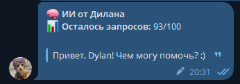
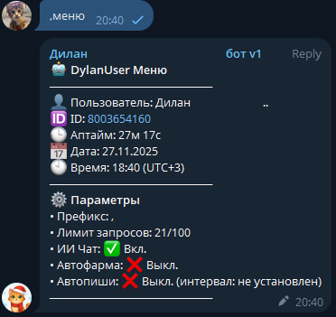
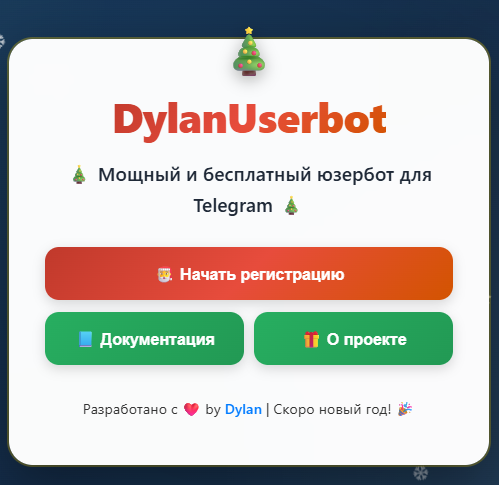

# DylanUserBot

**🔥 Мощный Telegram UserBot от Dylan**

**DylanUserBot** — бесплатный и безопасный юзербот для Telegram, расширяющий возможности вашего аккаунта. Регулярные обновления делают его удобным инструментом для автоматизации и управления чатами.  

📗 **Документация проекта:** [тык](https://teletype.in/@dragoninc4/DYLANLP)  
📗 **Все команды(может быть не актально) юзербота:** [тык](https://teletype.in/@dragoninc4/command) 
🌐 **Сайт / регистрация:** [dyln.k.vu](https://dyln.k.vu)  
🤖 **Подключить юзербота:** [Dylan](https://t.me/zhes19)  
😁 **Тг ссылки:** [Отзывы](https://t.me/dylnrep) | [Тг канал](https://t.me/dylnuser) | [Новости](https://t.me/dylnews) | [Чат проекта](https://t.me/dyln4at)  

🎁 **Бонус:** Возможность протестировать отечественный VPN!!!!!!!!!!!!!! (подробности в ЛС).  

---

## 🚀 Особенности DylanUserBot

- ⚡ Автоматизация: автоответы, автописалка, ИИ, доверенные, шаблоны и т.д (чекайте документацию
- 🛠 Разные команды и функции  
- 🌐 Собственный сервер и поддержка 24/7  
- 🔄 Постоянные обновления и исправление багов  
- 💸 Бесплатно и безопасно

---

## Крутые особенности

### ИИ функции
  
Бесплатные функции ИИ для автоматизации и помощи.

### Система довернных пользователей
  
Выполнение команд доверенными пользователями без участия юзербота.(от другого человека
### Сайт для регистрации

крутой кстати

## ❓ FAQ

A - Задает вопрос
B - Разработчик отвечает

**A:** Это бесплатно?  
**B:** Да, полностью на момент 07.11.2025

**A:** Чем DylanUserBot лучше других юзерботов?  
**B:** Безопасность, простота подключения и регулярные обновления, быстрота

**A:** Есть подвох?  
**B:** Ну я не заметил.

**A:** Как авторизоваться?  
**B:** Перед регистрацией напишите [мне](https://t.me/zhes19) и зарегистрируйтесь через [этот сайт](https://dyln.k.vu).  

**A:** Это безопасно?  
**B:** Абсолютно(наверно). Все отзывы доступны в тгк канале [@dylnrep](https://t.me/dylnrep).  

**A:** Я вам не верю. Сколько вы уже аккаунтов украли?  
**B:** Ноль. Зарегистрированных случаев кражи аккаунтов у нас нет. Вы всегда можете проверить отзывы и участников в нашем чате — если хотите, пришлю ссылку на человека который оставил отзыв. Еще зачем мне делать столько команд для кражи аккаунтов(лол). Юзербот для меня практически бесплатен: содержание обходится примерно в 0 ₽.

**A:** Где посмотреть команды и функции?  
**B:** Используйте команду `хелп` или смотрите [документацию](https://teletype.in/@dragoninc4/DYLANLP).

**A:** Откуда бесплатный ии?  
**B:** Ай все тебе да расскажи. Короче просто мой прапрапрадядя по маминой линни владел OpenAI ну я случайно увидел api ключ и взял домой.  
